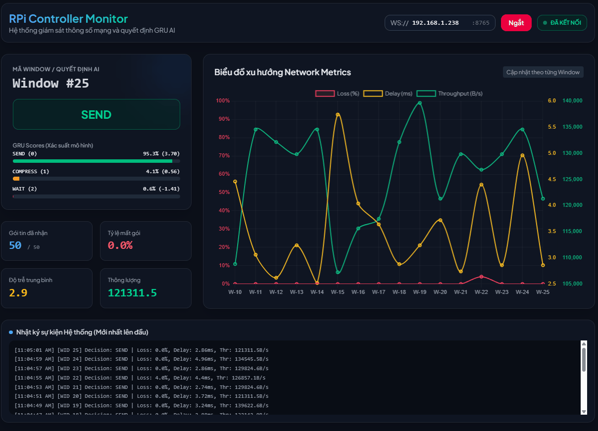
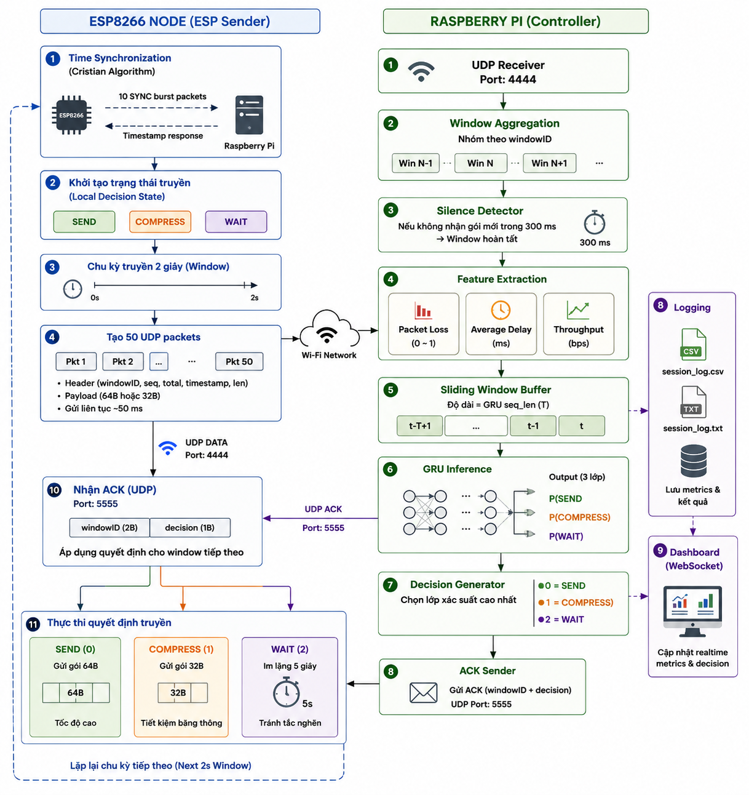

# 🚀 Intelligent Edge-AI Adaptive Transmission System


---

# 📖 Overview

This project proposes an intelligent Edge-AI communication framework capable of dynamically adapting IoT transmission behavior according to real-time network conditions.

The system continuously monitors:

* Packet Loss
* Delay
* Throughput

and uses a GRU neural network running on a Raspberry Pi edge device to determine the optimal transmission strategy.

The resulting decision is fed back to the ESP8266 node, creating a fully autonomous closed-loop communication system.

---

# 🎬 Live Dashboard Demo

> Real-time monitoring of packet loss, delay, throughput, GRU prediction scores and communication decisions.
<p align="center">
  
</p>

---

# 🏗 System Architecture

The architecture consists of:

### Sensor Layer

* ESP8266 Node
* Data Collection
* UDP Packet Generation

### Communication Layer

* Wi-Fi Network
* UDP Protocol
* Cristian Time Synchronization

### Edge Computing Layer

* Raspberry Pi 4B
* Packet Collection
* Feature Extraction

### Edge AI Layer

* GRU Neural Network
* Temporal Sequence Learning
* Decision Prediction

### Feedback Layer

* ACK Transmission
* Adaptive Control

### Monitoring Layer

* WebSocket Dashboard
* CSV Logging
* TXT Logging

---

# 🔄 System Workflow

The complete workflow consists of:

1. Time Synchronization
2. UDP Data Transmission
3. Window Aggregation
4. Burst Detection
5. Feature Extraction
6. Sliding Window Buffering
7. GRU Inference
8. Decision Generation
9. ACK Feedback
10. Adaptive Transmission

<p align="center">
  
</p>

---

# 🧠 Edge AI Decision Engine

The Raspberry Pi computes three network metrics for every communication window:

| Feature     | Description        |
| ----------- | ------------------ |
| Packet Loss | Packet loss ratio  |
| Delay       | Average delay (ms) |
| Throughput  | Throughput (B/s)   |

These metrics form the GRU input sequence:

```text
[
 packet_loss,
 average_delay,
 throughput
]
```

The model predicts one of three classes.

---

## Decision Classes

| Class | Action   |
| ----- | -------- |
| 0     | SEND     |
| 1     | COMPRESS |
| 2     | WAIT     |

### SEND

```text
Payload = 64 Bytes
```

Normal communication.

---

### COMPRESS

```text
Payload = 32 Bytes
```

Reduced bandwidth usage.

---

### WAIT

```text
Pause = 5 Seconds
```

Congestion avoidance mode.

---

# 📊 Dashboard Features

The real-time dashboard displays:

* Window ID
* Packet Loss
* Delay
* Throughput
* GRU Scores
* Predicted Class
* Historical Trends

Communication updates are streamed using:

```text
WebSocket Port 8765
```

---

# 📂 Project Structure

```text
.
├── esp_sender/
│   └── esp_sender.ino          # Arduino sketch for ESP8266 sender node
│
├── rpi_receiver/
│   └── rpi_controller.py       # Main RPi controller: UDP receiver + GRU inference + ACK
│
├── dataset/
│   └── raw_metrics.csv         # Raw training dataset
│
├── logs/
│   ├── session_log.csv         # Per-window session log (runtime output)
│   ├── session_log.txt         # Human-readable log (runtime output)
│   ├── plot_loss.png           # Packet loss chart (generated by plot.py)
│   ├── plot_delay.png          # Average delay chart (generated by plot.py)
│   ├── plot_throughput.png     # Throughput chart (generated by plot.py)
│   └── plot_combined.png       # Combined 3-panel chart (generated by plot.py)
│
├── docs/
│   ├── dashboard.gif           # Live dashboard demo animation
│   └── images/
│       └── system_archi.png    # System architecture diagram
│
├── src/
│   ├── collect_data/           # Data collection scripts
│   │   ├── esp_data.ino
│   │   └── rpi_data.py
│   ├── dashboard.html          # WebSocket real-time dashboard (browser)
│   ├── train.py                # GRU model training script
│   └── gru_model.pt            # Trained GRU model checkpoint
│
├── plot.py                     # Log visualization script (generates PNG charts)
├── requirements.txt
└── README.md
```

---

# ⚙ Installation

## Raspberry Pi

```bash
git clone https://github.com/hgiang0212/Adaptive-Transmission.git

pip install -r requirements.txt
```

Run controller:

```bash
python rpi_receiver/rpi_controller.py
```

---

## ESP8266

Upload:

```text
esp_sender.ino
```

using:

* Arduino IDE
* PlatformIO

Configure:

```cpp
const char* WIFI_SSID = "...";
const char* WIFI_PASSWORD = "...";
```

---

# 📉 Log Visualization

`plot.py` reads the session log produced by the RPi controller and generates four static PNG charts for offline analysis.

```bash
python plot.py
```

Output files saved to `logs/`:

| File | Content |
| ---- | ------- |
| `plot_loss.png` | Packet loss ratio over elapsed time |
| `plot_delay.png` | Average delay (ms) over elapsed time |
| `plot_throughput.png` | Throughput (B/s) over elapsed time |
| `plot_combined.png` | All three metrics in a single 3-panel figure |

Charts use a **serif font** (LaTeX-style), **white background**, and the **Tableau `tab10`** color palette for clear, publication-ready figures.

---

# 📈 Experimental Results

The proposed adaptive communication framework achieved:

| Metric                     | Improvement |
| -------------------------- | ----------- |
| Packet Loss                | ↓           |
| Delay                      | ↓           |
| Network Congestion         | ↓           |
| Bandwidth Efficiency       | ↑           |
| Autonomous Decision Making | ✓           |

---

# 🔬 Research Contributions

✔ Edge AI-based Communication Control

✔ GRU-based Network Condition Prediction

✔ Closed-loop Adaptive Transmission

✔ Lightweight IoT Deployment

✔ Real-time Dashboard Monitoring

✔ Raspberry Pi Edge Inference

---

# 🛠 Technology Stack

### Hardware

* ESP8266
* Raspberry Pi 4B

### Communication

* UDP
* Wi-Fi
* WebSocket

### Machine Learning

* PyTorch
* GRU

### Software

* Python
* Arduino C++
* Matplotlib / Pandas (log visualization)

---

# ⭐ Acknowledgements

This project was developed as part of research on:

* Edge Intelligence
* Intelligent IoT Systems
* Adaptive Communication Networks
* Machine Learning for Network Optimization
